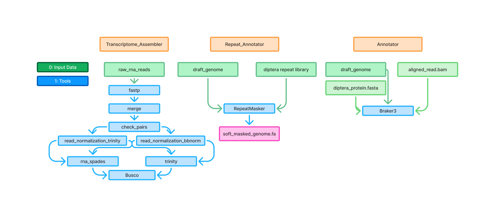

# Mosquito De Novo Analysis Pipeline

A comprehensive collection of pipelines for mosquito genome and transcriptome analysis. This repository contains standardized workflows for transcriptome assembly, genome annotation, and repeat identification.

## Pipeline Summary

| Pipeline              | Purpose                     | Input Directory         | Output Directory                  |
|-----------------------|-----------------------------|--------------------------|------------------------------------|
| Transcriptome Assembly | Assemble RNA-seq data      | data/raw_reads/         | results/transcriptome_assembly/   |
| Maker Annotator       | Annotate genome            | data/genome/            | results/maker_annotator/          |
| Repeat Annotator      | Mask repeats               | data/genome/, data/repeats/ | results/repeat_annotator/     |

## Repository Structure

```
mosquito_denovo/
├── data/                       # Input data files
│   ├── raw_reads/              # RNA-seq FASTQ files
│   ├── genome/                 # Genome FASTA files
│   └── repeats/                # Repeat libraries
├── results/                    # Results organized by pipeline
│   ├── transcriptome_assembly/ # Transcriptome assembly results
│   ├── maker_annotator/        # Genome annotation results
│   └── repeat_annotator/       # Repeat masking results
├── logs/                       # Log files organized by pipeline
├── temp/                       # Temporary files
├── pipelines/                  # Pipeline scripts
│   ├── transcriptome_assembly/ # RNA-seq assembly pipeline
│   ├── maker_annotator/        # BRAKER/MAKER genome annotation
│   └── repeat_annotator/       # RepeatMasker pipeline
└── config/                     # Configuration files
    └── paths.sh                # Centralized path definitions
```

## Pipelines

### 1. Transcriptome Assembly

Processes RNA-seq data through quality control, merging, normalization, and assembly steps.

**Pipeline Steps:**
1. Quality trimming with fastp
2. Read merging
3. Paired-end validation
4. Read normalization (Trinity and BBNorm methods)
5. Transcriptome assembly
6. BUSCO quality assessment

**Usage:**
```bash
sbatch pipelines/transcriptome_assembly/bin/main.sh [data_dir] [results_dir]
```

### 2. Genome Annotation (BRAKER)

Performs gene prediction and annotation using RNA-seq evidence.

**Pipeline Steps:**
1. Genome preparation
2. RNA-seq alignment integration
3. BRAKER gene prediction
4. Gene model extraction and statistics

**Usage:**
```bash
sbatch pipelines/maker_annotator/bin/main.sh [genome_dir] [results_dir]
```

### 3. Repeat Annotation

Identifies and masks repetitive elements in genome assemblies.

**Pipeline Steps:**
1. RepeatMasker analysis with custom repeat library
2. Summary statistics generation

**Usage:**
```bash
sbatch pipelines/repeat_annotator/bin/main.sh [genome_dir] [results_dir]
```

## Setup

### Directory Structure

Create the required directory structure:
```bash
mkdir -p data/{raw_reads,genome,repeats}
mkdir -p results/{transcriptome_assembly,maker_annotator,repeat_annotator}
mkdir -p logs/{transcriptome_assembly,maker_annotator,repeat_annotator}
mkdir -p temp/{transcriptome_assembly,maker_annotator,repeat_annotator}
```

### Data Preparation

Place your input files in the appropriate directories:
- RNA-seq reads: `data/raw_reads/`
- Genome assemblies: `data/genome/`
- Repeat libraries: `data/repeats/`
- RNA-seq alignment: `data/transcriptome.bam`

### Dependencies

These pipelines rely on several bioinformatics tools accessible via conda environments:

1. For transcriptome assembly:
   - fastp
   - BBMap
   - Trinity
   - BUSCO

2. For genome annotation:
   - BRAKER
   - GeneMark-ET
   - Augustus

3. For repeat annotation:
   - RepeatMasker
   - TRF (Tandem Repeats Finder)

## Usage Examples

### Complete Transcriptome Assembly

```bash
# Run with default paths (data/raw_reads)
sbatch pipelines/transcriptome_assembly/bin/main.sh

# Run with custom input and output paths
sbatch pipelines/transcriptome_assembly/bin/main.sh /path/to/reads /path/to/results

# Run in debug mode (skips steps with existing outputs)
sbatch pipelines/transcriptome_assembly/bin/main.sh -d
```

### Genome Annotation

```bash
# Run with default paths (data/genome)
sbatch pipelines/maker_annotator/bin/main.sh

# Specify genome directory
sbatch pipelines/maker_annotator/bin/main.sh /path/to/genome /path/to/results
```

### Repeat Masking

```bash
# Run with default paths (data/genome)
sbatch pipelines/repeat_annotator/bin/main.sh

# Specify genome and results directories
sbatch pipelines/repeat_annotator/bin/main.sh /path/to/genome /path/to/results
```

## Job Management

All pipelines use SLURM for job scheduling. To check job status:
```bash
squeue -u $USER
```

To cancel all pending jobs:
```bash
scancel -u $USER
```

## Output Descriptions

Each pipeline produces structured output in the `results/` directory:

### Transcriptome Assembly

- `01_trimmed/`: Quality-trimmed reads
- `02_merged/`: Merged read files
- `03_pairs/`: Validated paired-end reads
- `04_normalized/`: Normalized reads (both methods)
- `05_assembly/`: Trinity assemblies
- `06_busco/`: Assembly quality assessments

### Genome Annotation

- `braker/`: BRAKER gene predictions
  - `augustus.hints.gtf`: Gene models in GTF format
  - `augustus.hints.aa`: Predicted protein sequences
  - `augustus.hints.gff3`: Gene models in GFF3 format

### Repeat Annotation

- RepeatMasker output files
- Masked genome sequences
- Repeat statistics

## Troubleshooting

Common issues and solutions:

- **Input data not found**: Ensure your data is in the expected location or specify the correct path.
- **Missing dependencies**: Check that all required conda environments are properly installed.
- **SLURM errors**: Check log files in the `logs/` directory for specific error messages.
- **Resource limitations**: Adjust memory or CPU requirements in individual scripts if needed.

## License

This software is available under the [appropriate license].

## Citation

If you use these pipelines in your research, please cite:

[Citation details]