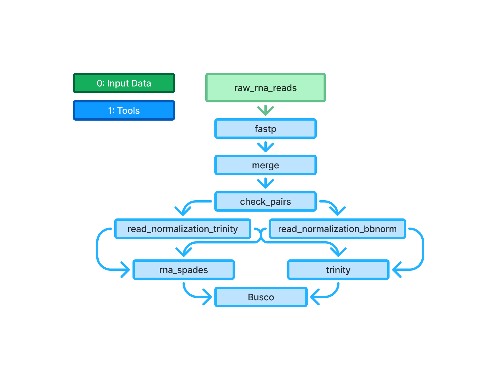

# cellSquito

## denovo mosquito transcriptome assembly pipeline

### Goal: Build a higher quality transcriptome pipeline to improve the reference transcriptome


### Pipeline Visualization
   


#### Steps to run pipeline: 

1. Clone and navigate into the repo
```
git clone git@github.com:meekrob/mosquito_denovo.git
cd cellSquito
```
2. Create the conda env 
```
conda create -f config/cellSquito.yml -n cellSquito
```
3. Run the main script
```
sbatch scripts/main.sh
```

***Note*** - the rna files and reference transcriptome need to be added to input directories & the slurm parameters may need to configured in the config/parameters.txt 


### Project Structure:
mosquito_denovo/
├── input/
│   ├── raw_reads/                   # Raw untrimmed paired-end reads
│   ├── trimmed_reads/               # Trimmed reads after fastp
│   └── draft_transcriptome/         # Original "best" transcriptome
│
├── results/                         # Output files from each step of the pipeline
│   ├── 01_trim/               # Results from merging and trimming steps
│   ├── 02_assembly/                 # De novo assembly results
│   ├── 03_busco_rnaQuast/           # Completness analysis outputs
│   └── 04_visualize/                # Visualization outputs and comparison graphs
│
├── scripts/
│   ├── mosquito_denovo.sh           # Main script that handles job submissions
│   ├── 01_merge_trim.sh             # Trim each read file and merge outputs
│   ├── 02_assembly.sh               # Assemble merged and trimmed RNA reads with draft transcriptome
│   ├── 03_busco_rnaQuast.sh         # Perform BUSCO & rnaQuast analysis on original & new transcriptome
│   └── 04_visualize.sh              # Visualize BUSCO outputs and comparisons
│
├── logs/                            # Directory to store .out & .err logs
│
└── configs/
    ├── cellSquito.yml                 # Conda environment specification
    └── data.tsv                     # Metadata table


### Tools:
- **zcat**: Merge paired-end RNA reads
- **fastp**: Trim and perform quality control
- **rnaSPAdes**: De novo transcriptome assembly
- **BUSCO**: Transcriptome assembly quality assessment
- **rnaQuast**: Transcriptome assembly quality assessment
- **R**: Visualization and comparison graphs
